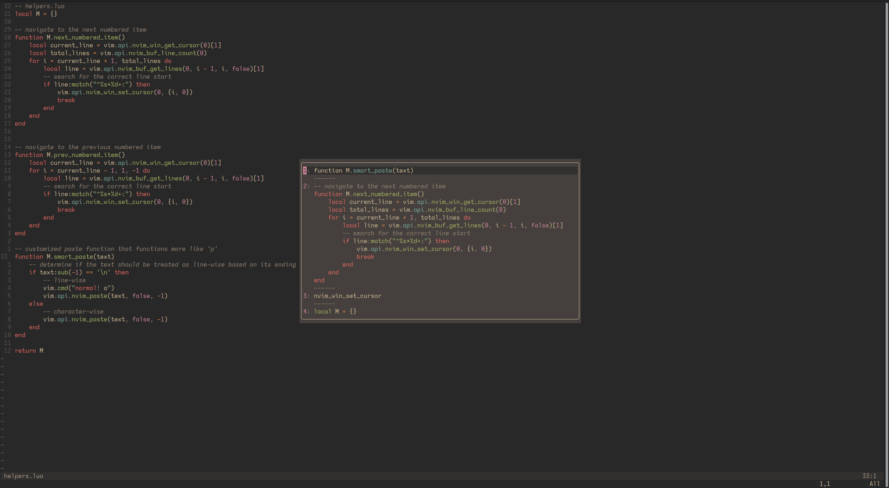

# YankBank

A Neovim plugin for keeping track of more recent yanks and deletions and exposing them in a quick access menu.

## What it Does

YankBank stores the N recent yanks into the unnamed register ("), then populates a popup window with these recent yanks, allowing for quick access to recent yank history.
Upon opening the popup menu, the current contents of the unnamedplus (+) register are also added to the menu (if they are different than the current contents of the unnamed register).

Choosing an entry from the menu (by hitting enter) will paste it into the currently open buffer at the cursor position.

### Screenshots

<!--  -->


The menu is specific to the current session, and will only contain the contents of the current unnamedplus register upon opening in a completely new session.
It will be populated further for each yank or deletion in that session.

## Installation and Setup

Lazy:
```lua
{
    "ptdewey/yankbank-nvim",
    config = function()
        require('yankbank').setup()
    end,
}
```

Packer:
```lua
use {
    'ptdewey/yankbank-nvim',
    config = function()
        require('yankbank').setup()
    end,
}
```

### Setup Options

The setup function also supports taking in a table of options:
| Option | Type | Default |
|-------------|--------------------------------------------|----------------|
| max_entries | integer number of entries to show in popup | `10` |
| sep | string separator to show between table entries | `"-----"` |
| keymaps | table containing keymap overrides | `{}` |
| keymaps.navigation_next | string | `"j"` |
| keymaps.navigation_prev | string | `"k"` |
| keymaps.paste | string | `"<CR>"` |
| keymaps.yank | string | `"yy"` |
| keymaps.close | table of strings | `{ "<Esc>", "<C-c>", "q" }` |
| num_behavior | string defining jump behavior "prefix" or "jump" | `"prefix"` |
| persist_type | string defining persistence type "sql" or "file" | `"sql"` | 
| persist_path | string defining path for persistence file | "/tmp/yankbank.db" |

If no separator is desired, pass in an empty string for sep:
```lua
    config = function()
        require('yankbank').setup({
            max_entries = 12,
            sep = "",
            keymaps = {
                navigation_next = "j",
                navigation_prev = "k",
            },
            num_behavior = "prefix",
            persist_type = "sql",
            persist_path = "/tmp/yankbank.db",
        })
    end,
```

The 'num_behavior' option defines in-popup navigation behavior when hitting number keys.
- `num_behavior = "prefix"` works similar to traditional vim navigation with '3j' moving down 3 entries in the bank.
- `num_behavior = "jump"` jumps to entry matching the pressed number key (i.e. '3' jumps to entry 3)
    - Note: If 'max_entries' is a two-digit number, there will be a delay upon pressing numbers that prefix a valid entry.


## Usage

The popup menu can be opened with the command:`:YankBank`, an entry is pasted at the current cursor position by hitting enter, and the menu can be closed by hitting escape, ctrl-c, or q.
An entry from the menu can also be yanked into the unnamedplus register by hitting yy.

I would personally also recommend setting a keybind to open the menu.
```lua
-- map to '<leader>y'
vim.keymap.set("n", "<leader>y", "<cmd>YankBank<CR>", { noremap = true })
```


## Potential Improvements

- Persistence between sessions (through either sqlite database or just a file)
- Polling on unnamedplus register to populate bank in more intuitive manner (could be enabled as option)
- nvim-cmp integration
- fzf integration
- Setup options configuring which registers are included

## Alternatives

- [nvim-neoclip](https://github.com/AckslD/nvim-neoclip.lua)
- [yanky.nvim](https://github.com/gbprod/yanky.nvim)
