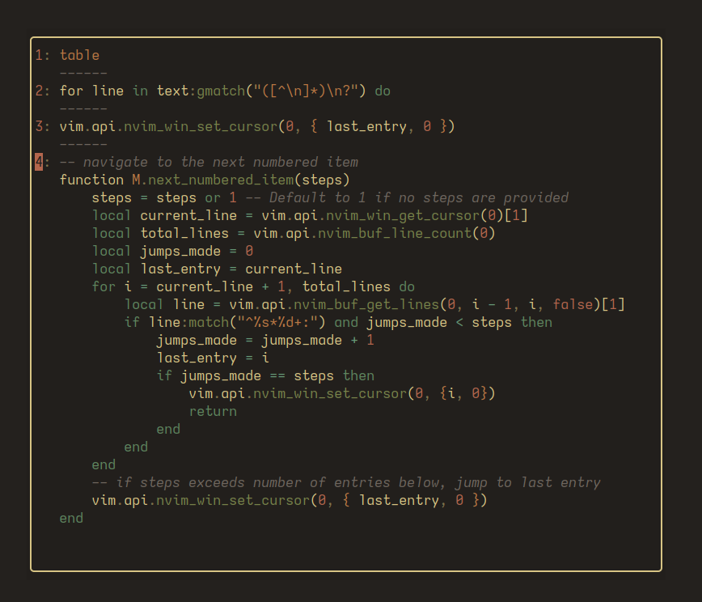

# YankBank

A Neovim plugin for keeping track of more recent yanks and deletions and exposing them in a quick access menu.

## What it Does

YankBank stores the N recent yanks into the unnamed register ("), then populates a popup window with these recent yanks, allowing for quick access to recent yank history.
Upon opening the popup menu, the current contents of the unnamedplus (+) register are also added to the menu (if they are different from the current contents of the unnamed register).

Choosing an entry from the menu (by hitting enter) will paste it into the currently open buffer at the cursor position.

YankBank also offers persistence between sessions, meaning that you won't lose your yanks after closing and reopening a session (see [persistence](#Persistence)).

### Screenshots



The menu is specific to the current session, and will only contain the contents of the current unnamedplus register upon opening in a completely new session.
It will be populated further for each yank or deletion in that session.

## Installation and Setup

#### With Persistence (Recommended)

Using lazy.nvim
```lua
{
    "ptdewey/yankbank-nvim",
    dependencies = "kkharji/sqlite.lua",
    config = function()
        require('yankbank').setup({
            persist_type = "sqlite",
        })
    end,
}
```

#### Without persistence:

Using lazy.nvim
```lua
{
    "ptdewey/yankbank-nvim",
    config = function()
        require('yankbank').setup()
    end,
}
```

### Setup Options

The setup function also supports taking in a table of options:
| Option | Type | Default |
|-------------|--------------------------------------------|----------------|
| max_entries | integer number of entries to show in popup | `10` |
| sep | string separator to show between table entries | `"-----"` |
| keymaps | table containing keymap overrides | `{}` |
| keymaps.navigation_next | string | `"j"` |
| keymaps.navigation_prev | string | `"k"` |
| keymaps.paste | string | `"<CR>"` |
| keymaps.yank | string | `"yy"` |
| keymaps.close | table of strings | `{ "<Esc>", "<C-c>", "q" }` |
| num_behavior | string defining jump behavior "prefix" or "jump" | `"prefix"` |
| focus_gain_poll | boolean | `nil` |
| registers | table container for register overrides | `{ }` |
| registers.yank_register | default register to yank from popup to | `"+"` |
| persist_type | string defining persistence type "memory" or "sqlite" | `"memory"` |


#### Example Configuration

```lua
{
    "ptdewey/yankbank-nvim",
    config = function()
        require('yankbank').setup({
            max_entries = 9,
            sep = "-----",
            num_behavior = "jump",
            focus_gain_poll = true,
            persist_type = "sqlite",
            keymaps = {
                paste = "<CR>",
            },
            registers = {
                yank_register = "+",
            },
        })
    end,
}
```

If no separator is desired, pass in an empty string for `sep`

The 'num_behavior' option defines in-popup navigation behavior when hitting number keys.
- `num_behavior = "prefix"` works similar to traditional vim navigation with '3j' moving down 3 entries in the bank.
- `num_behavior = "jump"` jumps to entry matching the pressed number key (i.e. '3' jumps to entry 3)
    - Note: If 'max_entries' is a two-digit number, there will be a delay upon pressing numbers that prefix a valid entry.

The 'focus_gain_poll' option allows for enabling an additional autocommand that watches for focus gains (refocusing Neovim window), and checks for changes in the unnamedplus ('+') register, adding to yankbank when new contents are found. This allows for automatically adding text copied from other sources (like a browser) to the yankbank without the bank opening trigger. Off by default, but I highly recommend enabling it with `focus_gain_poll = true`.

### Persistence
For the best experience with YankBank, enabling persistence is highly recommended.
If persistence is enabled, sqlite.lua will be used to create a persistent store for recent yanks in the plugin root directory.
To utilize sqlite persistence, `"kkharji/sqlite.lua"` must be added as a dependency in your config, and `persist_type` must be set to `"sqlite"`:

```lua
-- lazy
return {
    "ptdewey/yankbank-nvim",
    dependencies = "kkharji/sqlite.lua",
    config = function()
        require('yankbank').setup({
            -- other options...
            persist_type = "sqlite"
        })
    end,
}
```


## Usage

The popup menu can be opened with the command:`:YankBank`, an entry is pasted at the current cursor position by hitting enter, and the menu can be closed by hitting escape, ctrl-c, or q.
An entry from the menu can also be yanked into the unnamedplus register by hitting yy.

I would personally also recommend setting a keybind to open the menu.
```lua
-- map to '<leader>y'
vim.keymap.set("n", "<leader>y", "<cmd>YankBank<CR>", { noremap = true })
```


## Potential Improvements
- nvim-cmp integration
- fzf integration
- telescope integration

## Alternatives

- [nvim-neoclip](https://github.com/AckslD/nvim-neoclip.lua)
- [yanky.nvim](https://github.com/gbprod/yanky.nvim)
